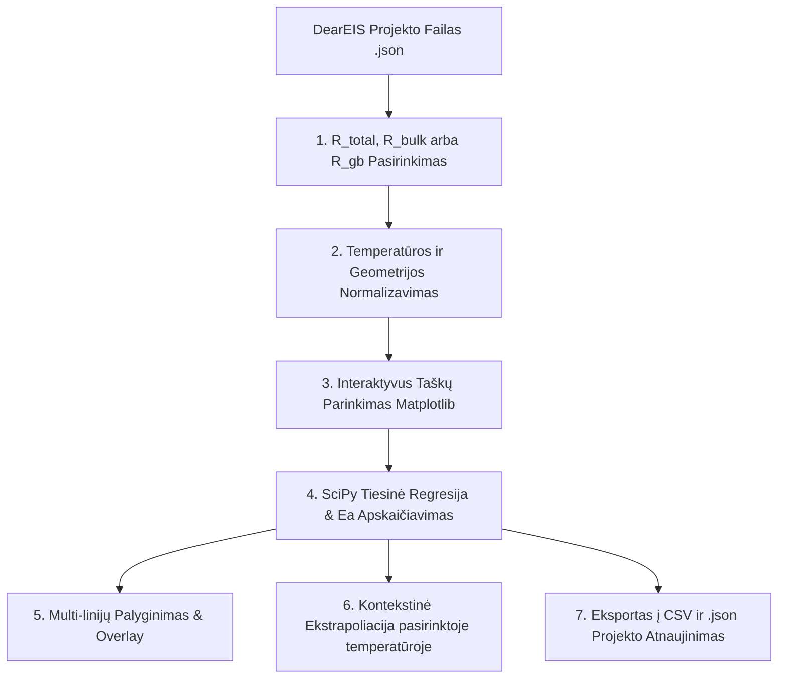

# 🌡️ Arenijaus Analizė
### Aktyvacijos Energijos ir Joninio Laidumo Modulis (`CeraMIS`)

[-orange.svg)](https://en.wikipedia.org/wiki/Scientific_notation)

---

**Arenijaus Analizės modulis** – tai pažangus elektrocheminis posistemis, integruotas į pagrindinę LLTO tyrimų programą. Jis yra skirtas apskaičiuoti kietųjų elektrolitų ličio jonų pernašos aktyvacijos energiją ($E_a$) bei ekstrapoliuoti joninio laidumo vertes ($\sigma$) pasirinktose temperatūrose, tiesiogiai importuojant išanalizuotus elektrocheminio impedanso spektroskopijos (EIS) projektus iš dearEIS sistemos.

---

## ⚙️ Pagrindinis Funkcionalumas ir Architektūra

Modulis leidžia atlikti greitą eksperimentinių taškų filtravimą, interaktyvų regresijos derinimą bei kelių laidumo mechanizmų palyginimą viename grafike.

---

## 📐 Fizikinis ir Matematika Modelis

Kietųjų kūnų ličio jonų laidumas yra tiesiogiai susijęs su temperatūra per **Arenijaus dėsnį joniniam laidumui**:

$$\sigma T = \sigma_0 \exp\left(-\frac{E_a}{k_B T}\right)$$

*   $\sigma$ – savitasis joninis laidumas ($\text{S/cm}$),
*   $T$ – absoliutinė temperatūra ($\text{K}$),
*   $\sigma_0$ – pre-eksponentinis faktorius ($\text{S}\cdot\text{K/cm}$),
*   $E_a$ – aktyvacijos energija ($\text{eV}$),
*   $k_B \approx 8.617333 \times 10^{-5}\,\text{eV/K}$ – Bolcmano konstanta.

### 1. Tiesinimas regresijai (Linearization)
Kad būtų galima pritaikyti tiesinės regresijos modelį (mažiausių kvadratų metodą), lygtis yra logaritmuojama:

$$\ln(\sigma T) = \ln(\sigma_0) - \frac{E_a}{k_B T}$$

Pakeitus koordinates į standartines regresijos koordinates $X = \frac{1000}{T}$ ir $Y = \ln(\sigma T)$, lygtis tampa tiese $Y = m \cdot X + C$:

$$\ln(\sigma T) = C + m \cdot \left(\frac{1000}{T}\right)$$

Iš čia išvestos tiesės nuolydis $m$ ir laisvasis narys $C$ yra tiesiogiai susiję su fizikiniais dydžiais:
*   **Aktyvacijos energija ($E_a$)**:
    $$E_a = -m \cdot 1000 \cdot k_B \quad (\text{eV})$$
*   **Pre-eksponentinis faktorius ($\sigma_0$)**:
    $$\sigma_0 = \exp(C) \quad (\text{S}\cdot\text{K/cm})$$

---

## 🛠️ Modulio ypatybės ir vartotojo valdikliai

### 1. Interaktyvus taškų parinkimas (`RectangleSelector`)
Vartotojas gali interaktyviai pažymėti taškus tiesiai ant grafiko, naudodamas pelės tempimo rėmelį:
*   **Kairysis pelės klavišas**: Įtraukia taškus į regresijos skaičiavimą (pažymimi mėlyna spalva).
*   **Dešinysis pelės klavišas**: Išbraukia taškus iš regresijos (pvz., atmetant matavimo triukšmą ar ribinius taškus, kur matuojamas nebe tūrinis laidumas).
*   Grafiko legenda ir apskaičiuotos $E_a$ bei $R^2$ reikšmės atnaujinamos akimirksniu realiuoju laiku.

### 2. Multi-linijų išsaugojimas („➕ Išsaugoti liniją“)
LLTO kietajame elektrolite jonų laidumo mechanizmas gali keistis priklausomai nuo temperatūros srities (pvz., kubinės-tetragoninės fazės virsmas ties aukštesne temperatūra):
*   Naudotojas gali pažymėti žemos temperatūros sritį, paspausti **„Išsaugoti liniją“** (ji užfiksuojama grafiko legendoje su savo spalva, $E_a$ bei $R^2$).
*   Tada pažymėti aukštos temperatūros sritį ir išsaugoti antrąją liniją. Tai leidžia viename grafike palyginti du skirtingus pernašos mechanizmus.

### 3. Kontekstinė ekstrapoliacija pasirinktoje temperatūroje
Įvesties laukelyje įrašius norimą temperatūrą (pvz., kambario temperatūrą $25\,\text{°C}$), programa pagal aktyvios tiesės lygtį automatiškai apskaičiuoja numatomą laidumą:
$$\sigma(T) = \frac{\sigma_0}{T} \exp\left(-\frac{E_a}{k_B T}\right)$$
*   **Dinaminis prisitaikymas**: Ekstrapoliacijos teksto spalva automatiškai pasikeičia į tos regresinės linijos spalvą, kuri šiuo metu yra aktyvi (arba ant kurios vartotojas paspaudė grafike).
*   **Mokslinis formatavimas**: Laidumo reikšmės išvedamos su taisyklingu moksliniu formatu ir viduriniuoju tašku (`·`), pvz., $\sigma(25\text{°C}) = 1.3456 \cdot 10^{-4}\text{ S/cm}$.

### 4. Ergonomiška dviguba ašis (Dual Axis)
Grafikas turi dvi X ašis:
*   **Apatinė X ašis**: $\frac{1000}{T}$ ($1/\text{K}$), skirta tiesiniam pasiskirstymui ir regresijai atlikti.
*   **Viršutinė X ašis**: atitinkama temperatūra Kelvinais ($T, \text{K}$), perskaičiuota netiesiškai, kad tyrėjas iškart vizualiai matytų tikrąją pavyzdžio temperatūrą.
