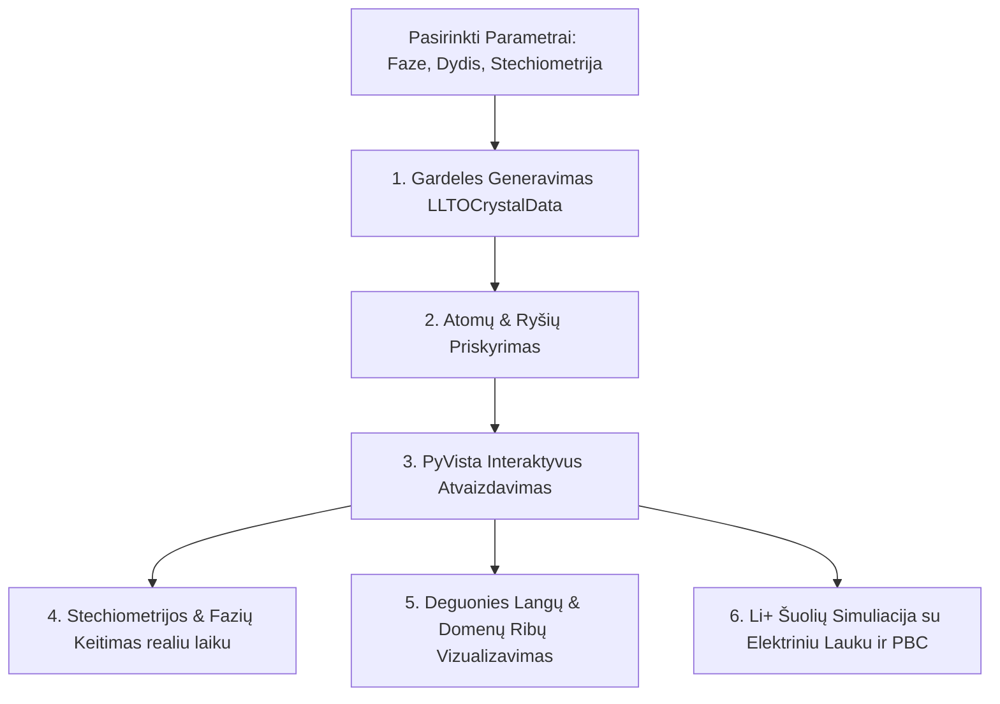

# 💎 3D Kristalo Simuliatorius
### LLTO Perovskito Gardelės ir Jonų Transporto Vizualizavimo Modulis (`llto_crystal_viewer.py`)

[-red.svg)](https://en.wikipedia.org/wiki/Perovskite)

---

**`llto_crystal_viewer.py`** – tai aukšto lygio, autonominis 3D kristalografinės vizualizacijos ir fizikinės simuliacijos įrankis. Jis skirtas tyrinėti ličio jonų kietojo elektrolito $\text{Li}_{3x}\text{La}_{2/3-x}\text{TiO}_3$ (LLTO) kristalinę perovskito struktūrą, oktaedrų pasvirusius iškraipymus, gardelės defektus bei temperatūros ir elektrinio lauko valdomą ličio jonų migraciją realiuoju laiku.

---

## ⚙️ Pagrindinis Funkcionalumas ir Architektūra

Simuliatorius apjungia profesionalų 3D braižymo variklį **PyVista** (VTK pagrindu) su **PyQt6** vartotojo sąsaja.

---

## 🏛️ Kristalografinės Fazės ir Iškraipymai

Programa leidžia sumodeliuoti ir tyrinėti net 7 skirtingas kietojo elektrolito būsenas:

1.  **Kubinė (Cubic)**: Simetriškiausia perovskito fazė. La, Li ir vakansijos yra visiškai atsitiktinai pasiskirsčiusios kubo kampuose (A-srityse) aplink $\text{TiO}_6$ oktaedrus.
2.  **Tetragoninė (Tetragonal) ir Ortorombinė (Orthorhombic)**: Simuliuoja sluoksniuotą LLTO struktūrą. Lanthanum-rich sluoksniai išsidėsto kas antrą plokštumą ($z \pmod 2 = 0$), o ličio jonai ir vakansijos telkiasi kitose plokštumose ($z \pmod 2 = 1$).
3.  **Monoklininė (Monoclinic)**: Žemos simetrijos struktūra su pasuktais ir deformuotais $\text{TiO}_6$ oktaedrais, atspindinti žemos temperatūros fazinius virsmus.
4.  **Ruddlesden-Popper (n=3)**: Didelio tikslumo sluoksniuota supergardelė. Atkuria trigubus perovskito blokus išilgai Z ašies, atskirtus uolienos druskos (rock-salt) tipo barjero, su pašalintais vertikaliaisiais deguonies ryšiais ties sandūra, imituojant planarines vakansijas.
5.  **Dvynių domenai (Twinned Domains)**: Sukuria dviejų gretimų kristalinių sričių (grūdelių) sandūrą. Dešinioji gardelės pusė yra fiziškai pasukama atsitiktiniu kampu visomis trimis ašimis naudojant Eulerio pasukimo matricas:
    $$\mathbf{R} = \mathbf{R}_z(\theta_z) \mathbf{R}_y(\theta_y) \mathbf{R}_x(\theta_x)$$
6.  **Amorfinė (Amorphous)**: Netvarki, išsilydžiusi būsena, kur visi atomai yra pastumti atsitiktiniu poslinkio vektoriumi ($\delta \le 0.2\,\text{Å}$).

---

## 🔬 Stechiometrija ir Fizikinis Mastelis

### 1. Stechiometrijos valdymas realiuoju laiku
Naudotojas gali tiksliai reguliuoti pavyzdžio cheminę sudėtį (La ir Li koncentracijas). Sistema automatiškai apskaičiuoja kationų vakansijų procentą pagal lygtį:
$$\text{Vacancy } \% = 100\% - (\text{La } \% + \text{Li } \% )$$
Vakansijos yra būtinos, kad kietajame elektrolite galėtų vykti jonų pernaša.

### 2. Atvaizdavimo stiliai
*   **Schematinis modelis**: Atomų spinduliai yra sumažinti (padauginti iš 0.3 koeficiento), kad aiškiai matytųsi $\text{TiO}_6$ oktaedrų tinklas, koordinaciniai ryšiai ir tuščios vietos, skirtos jonų judėjimui.
*   **Realus modelis (Shannon joniniai spinduliai)**: Visi atomai atvaizduojami pagal jų tikruosius Shannon joninius spindulius, normalizuotus pagal gardelės konstantą $a = 3.9\,\text{Å}$:
    $$\text{Spindulys}_{\text{normalizuotas}} = \frac{r_{\text{Shannon}}}{3.9\,\text{Å}}$$
    Tai leidžia vizualiai įvertinti atomų pakavimo tankį ir pamatyti erdvinius "butelio kakliukus" (bottlenecks), pro kuriuos turi spaustis migruojantys ličio jonai.

---

## ⚡ Jonų šuolių ir elektrinio lauko simuliacija

Modulyje įdiegtas dinaminis ličio jonų judėjimo variklis, veikiantis PyQt `QTimer` pagrindu.

### 1. Kaimyninių porų paieška
Kiekviename animacijos žingsnyje programa ieško arti vienas kito esančių Li jonų ir laisvų vakansijų. Atstumas tarp jų turi atitikti artimiausio kaimyno atstumą:
$$d(\text{Li} \to \text{Vac}) = 1.0 \pm 0.25 \text{ gardelės vieneto}$$

### 2. Temperatūros poveikis
Naudotojas slankikliu gali nustatyti temperatūrą nuo **145 K iki 1060 K**. Temperatūra tiesiogiai keičia animacijos greitį: aukštesnėje temperatūroje šuolio laikas sutrumpėja (simuliuojant padidėjusią jonų kinetinę energiją):
$$\Delta t_{\text{interval}} = \max\left(5\text{ ms}, \text{round}\left(30\text{ ms} \times \frac{300\,\text{K}}{T}\right)\right)$$

### 3. Elektrinio lauko valdomas dreifas (Drift)
Įjungus elektrinį lauką išilgai X ašies ($+X$), judėjimo tikimybės pasiskirstymas tampa anizotropinis. Kiekvienai porai priskiriamas svoris:
*   **Judėjimas su lauku ($+X$)**: Svoris padidinamas iki `20.0` (labai didelė tikimybė).
*   **Judėjimas prieš lauką ($-X$)**: Svoris sumažinamas iki `0.05` (itin maža tikimybė).
*   **Judėjimas statmenai laukui ($Y, Z$)**: Svoris yra neutralus (`2.0`).

### 4. Periodinės ribinės sąlygos (PBC) ir Nepertraukiamas srautas (Inflow / Outflow)
Kad simuliacija nevyktų tik uždaroje gardelėje (kur greitai visi Li jonai nuskubėtų į dešinį kraštą), įdiegtos atviros periodinės sąlygos:
*   **Outflow**: Li jonas, pasiekęs dešinįjį supergardelės pakraštį ($X = N_x$), elektrinio lauko yra išstumiamas lauk iš kristalo į tuščią erdvę.
*   **Inflow**: Kad būtų išlaikytas sistemos neutralumas (įkrovos balansas), tuo pat metu kairiajame krašte ($X = 0$) atsitiktinėje laisvoje vakansijoje yra sugeneruojamas naujas Li jonas. Tai sukuria nepertraukiamo srovės srauto iliustraciją.

---

## 🛠️ Interaktyvūs vizualūs įrankiai

*   **Deguonies langai (Oxygen Windows)**: Apvedami mėlyni pusiau permatomi $\text{O}_4$ kvadratiniai langai (face loops), pro kuriuos $\text{Li}^+$ jonas fiziškai turi praeiti judėdamas iš vienos A-srities į kitą. Tai padeda pamatyti, kaip oktaedrų pasvyrimas susiaurina arba praplečia šiuos langus.
*   **Domenų riba (Domain Boundary)**: Ryškiai oranžinė plokštuma, vizualizuojanti sandūrą tarp dviejų skirtingos orientacijos grūdelių dvynių režime.
*   **Fono spalvos keitimas**: Galimybė perjungti tarp didelio kontrastingumo balto fono (profesionaliems mokslo straipsnių paveikslėliams) ir modernaus tamsaus fono (patogiam darbui ekrane).
*   **Momentinės nuotraukos eksportas**: mygtukas **📷 Eksportuoti PNG** leidžia akimirksniu išsaugoti esamą 3D kameros kampą ir gardelės būseną kaip aukštos rezoliucijos PNG paveikslėlį.
