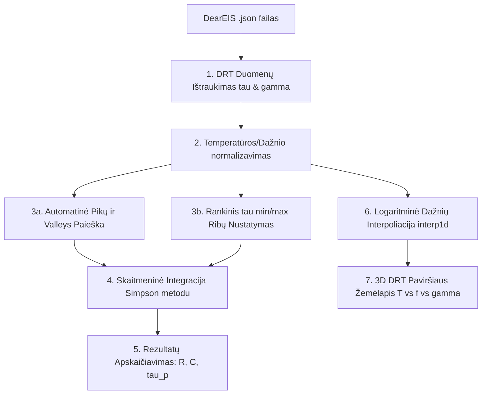

# ⚡ DRT Analizė
### Atsipalaidavimo Trukmių Pasiskirstymo Modulis (`CeraMIS`)

[-green.svg)](https://scipy.org/)

---

**DRT (Distribution of Relaxation Times) Analizės modulis** – tai elektrocheminis įrankis, skirtas didelės raiškos poliarizacinių procesų analizei. Jis leidžia atskirti persidengiančius impedanso spektroskopijos (EIS) puslankius (pvz., greitąjį tūrinį laidumą nuo lėtesnio grūdelių ribų laidumo ar dar lėtesnės elektrodų poliarizacijos), nustatyti jų relaksacijos trukmes ($\tau$), apskaičiuoti poliarizacijos varžas ($R$) bei efektyviąsias talpas ($C$), taip pat braižyti **3D DRT žemėlapius** priklausomai nuo temperatūros ir dažnio.

---

## ⚙️ Pagrindinis Funkcionalumas ir Architektūra

Modulis tiesiogiai integruojasi su [dearEIS](https://github.com/vyrjana/DearEIS) projekto failais, ištraukdamas apskaičiuotus DRT spektro duomenis ($\tau$ ir $\gamma$) ir atlikdamas jų integravimą bei trimatį atvaizdavimą.

---

## 📐 Fizikinis ir Matematika Modelis

Didelė dalis elektrocheminių sistemų (ypač kietųjų elektrolitų) pasižymi persidengiančiais puslankiais Naikvisto grafike, todėl standartinis ekvivalentinių grandynų parinkimas tampa nepatikimas. DRT metodas išsprendžia šią problemą, konvertuodamas eksperimentinį impedansą $Z(\omega)$ į tolydų relaksacijos trukmių pasiskirstymą $\gamma(\ln \tau)$ per integralinę lygtį:

$$Z(\omega) = R_ {\infty} + R_ {p} \int_{-\infty}^{\infty} \frac{\gamma(\ln \tau)}{1 + j \omega \tau} \, d(\ln \tau)$$

### 1. Poliarizacijos varžos ($R$) skaitmeninė integracija
Kiekvienas DRT spektro pikas atitinka atskirą elektrocheminį procesą (pvz., ličio jonų dreifą per grūdelius ar jų ribas). Šio proceso poliarizacijos varža ($R$) yra lygi piko plotui, integruojant logaritminėje trukmių skalėje:

$$R = \int_{\tau_ {\min}}^{\tau_ {\max}} \gamma(\ln \tau) \, d(\ln \tau)$$

Programa šią integraciją atlieka skaitmeniškai, taikydama **Simpsono (Simpson) taisyklę** (`scipy.integrate.simpson`) per parinktą taškų intervalą:

$$R = \text{simpson}(y=\gamma, x=\ln \tau)$$

### 2. Efektyviosios talpos ($C$) apskaičiavimas
Suradus piko maksimumo relaksacijos trukmę ($\tau_ {p}$), kurioje pasiekiama didžiausia $\gamma$ reikšmė, bei piko integralinę varžą ($R$), efektyvioji proceso talpa ($C$) apskaičiuojama pagal fundamentaliąją laiko konstantos lygtį:

$$\tau_ {p} = R \cdot C \implies C = \frac{\tau_ {p}}{R}$$

---

## 🛠️ Modulio ypatybės ir vartotojo valdikliai

### 1. Automatinis piko ir papėdžių (Valleys) aptikimas
Jei vartotojas nenurodo integravimo rėžių ($\tau_{\min}$ ir $\tau_{\max}$ laukeliai paliekami tušti), programa automatiškai:
1.  Suranda didžiausią spektro piką naudodama `scipy.signal.find_peaks` algoritmą su $10\%$ slenksčiu nuo maksimalios reikšmės:
    `find_peaks(gamma, height=np.max(gamma)*0.1)`
2.  Nustato piko „papėdes“ (valley ribas), skenuodama į kairę ir į dešinę nuo viršūnės, kol kreivės intensyvumas nukrenta žemiau $5\%$ piko maksimumo:
    `thresh = gamma[peak_idx] * 0.05`
3.  Šį dinamiškai išskirtą rėžį automatiškai panaudoja Simpsono integracijai.

### 2. 3D DRT Žemėlapis (3D Surface Mapping)
Paspaudus mygtuką **„🗺️ Braižyti 3D DRT“**, sukuriamas išsamus trimatis paviršius:
*   **Dažnių konvertavimas**: Relaksacijos trukmės $\tau$ paverčiamos į fizikinius dažnius:
    $$f = \frac{1}{2 \pi \tau} \quad (\text{Hz})$$
*   **Logaritminė interpoliacija**: Kadangi skirtingose temperatūrose dearEIS eksperimento dažnių tinkleliai gali nesutapti, programa atlieka logaritminį interpoliavimą (`np.geomspace` ir `scipy.interpolate.interp1d`) per 200 taškų ašį, sukurdama 3D tinklelį.
*   **Vartymas erdvėje**: Sukuriamas trimatis Matplotlib `plot_surface` grafikas su *viridis* spalvų palete, kurį vartotojas gali sukioti pele visomis kryptimis, stebėdamas, kaip didėjant temperatūrai grūdelių ribų pikas slenka į aukštesnių dažnių sritį (gretėja relaksacija).
*   **Momentinis atvaizdavimas**: Išlaikytas interaktyvus mygtukų stabilumas, naudojant dvigubą geometrijos refresh'ą, kad 3D langas atsidarytų pritaikytas ekrane.
