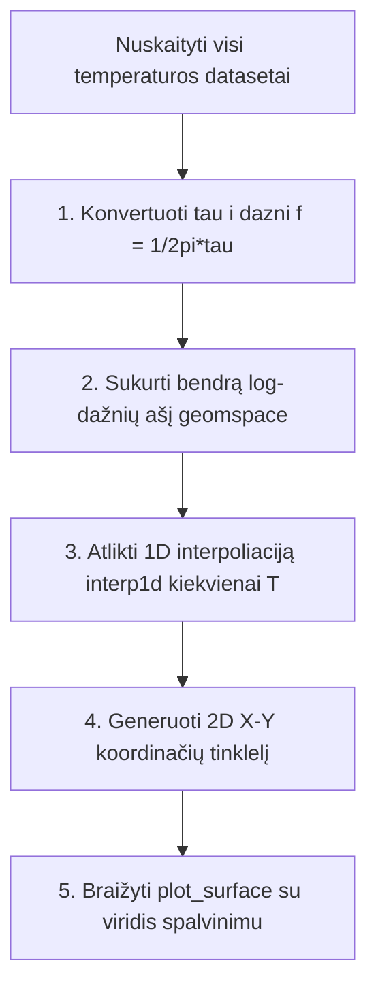

# 📊 Grafinis Atvaizdavimas ir 3D Analizė
### EIS Spektroskopijos ir Paviršiaus Topografijos Skaičiavimo Metodika

---

Šis dokumentas pateikia išsamų **LLTO tyrimų programos** grafinio variklio aprašymą. Jame detaliai paaiškinamos fizikinės lygtys ir skaičiavimo algoritmai, naudojami 9 grafikų (3x3) impedanso spektroskopijos matricoje, bei trimatės rekonstrukcijos (3D DRT žemėlapio bei 3D SEM paviršiaus reljefo) kūrimo mechanika.

---

## 📐 1. 3x3 Grafinės Matricos Skaičiavimo Lygtys

Visi eksperimentiniai impedanso taškai $Z(\omega) = Z' - j Z''$ yra normalizuojami atsižvelgiant į bandinio geometrinius matmenis – **stori** ($L$) ir **plotą** ($A$):

$$\text{Geometrinis koeficientas: } k_{AL} = \frac{A}{L} \quad (\text{m})$$

$$Z_n = Z \cdot k_{AL} = Z_n' - j Z_n'' \quad (\Omega\cdot\text{m})$$

Taikant šį geometrinį normalizavimą, visi grafikai yra atvaizduojami fizikiniais vienetais, eliminuojant pavyzdžio matmenų įtaką.

### 2D grafikų skaičiavimo formulės:

1.  **Savitasis realusis laidumas ($\sigma'$)**:
    $$\sigma' = \frac{Z_n'}{|Z_n|^2} = \frac{Z_n'}{(Z_n')^2 + (Z_n'')^2} \quad (\text{S/m})$$
2.  **Reali dielektrinė skvarba ($\varepsilon'$)**:
    $$\varepsilon' = \frac{-Z_n''}{\omega \cdot \varepsilon_0 \cdot |Z_n|^2} \quad (\text{vnt.})$$
    *   $\omega = 2 \pi f$ – kampinis dažnis ($\text{rad/s}$),
    *   $\varepsilon_0 \approx 8.8541878 \times 10^{-12}\,\text{F/m}$ – elektrinė konstanta (vakuumo dielektrinė skvarba).
3.  **Dielektriniai nuostoliai ($\varepsilon''$)**:
    $$\varepsilon'' = \frac{Z_n'}{\omega \cdot \varepsilon_0 \cdot |Z_n|^2} \quad (\text{vnt.})$$
4.  **Dielektrinių nuostolių tangentas ($\tan \delta$)**:
    $$\tan \delta = \frac{\varepsilon''}{\varepsilon'}$$
5.  **Elektrinis modulis ($M''$)**:
    $$M'' = \omega \cdot \varepsilon_0 \cdot Z_n' \quad (\text{vnt.})$$
6.  **Summerfield skalavimas (Universalus laidumo dėsnis)**:
    Naudojamas analizuoti jonų šokinėjimo (hopping) dinamiką nepriklausomai nuo temperatūros:
    *   Absoliutinis X taškas: $X = \frac{f}{\sigma_{dc} \cdot T}$
    *   Absoliutinis Y taškas: $Y = \frac{\sigma'}{\sigma_{dc}}$
    *   $\sigma_{dc}$ apskaičiuojama kaip minimali savitojo laidumo vertė žemų dažnių srityje ($\sigma_{dc} \approx \min(\sigma')$).
7.  **Pseudo-DRT (atsipalaidavimo trukmių pasiskirstymo aproksimacija)**:
    Greitasis metodas piko dažniams identifikuoti neatliekant sudėtingo integralinio dekonvoliutavimo:
    $$\text{Pseudo-DRT} = -\frac{dZ_n'}{d(\log_{10} f)}$$
    Skaičiuojama naudojant skaitinį gradientą išilgai logaritminės dažnio ašies.
8.  **Cole-Cole grafikas**:
    Vaizduoja dielektrinių nuostolių priklausomybę nuo realiosios dielektrinės skvarbos: $\varepsilon''$ priklausomybė nuo $\varepsilon'$.

---

## 🗺️ 2. Trimačių (3D) Grafikų kūrimo algoritmai

Programoje integruoti du visiškai skirtingi 3D grafiniai varikliai: **Matplotlib 3D** (spektrinei analizei) ir **PyVista/VTK** (erdviniam reljefui).

### 💡 A. 3D DRT Spektro Žemėlapis (T vs f vs Amplitude)
Šis grafikas apjungia visų temperatūrų DRT atsipalaidavimo kreives $\gamma(\ln \tau)$ į vientisą trimatį paviršių.

1.  **Interpoliacijos būtinybė**: Kadangi skirtingose temperatūrose [dearEIS](https://github.com/vyrjana/DearEIS) eksperimento dažnių taškai skiriasi, tiesiogiai sujungti jų į tinklelį neįmanoma.
2.  **Dažnių tinklelis**: Sukuriamas vienodas geometrinis logaritminis dažnių tinklelis nuo minimalaus iki maksimalaus dažnio:
    `np.geomspace(f_min, f_max, 200)`
3.  **Interpoliavimas**: Kiekvienam temperatūros pavyzdžiui DRT reikšmės $\gamma$ yra interpoliuojamos išilgai dažnio ašies:
    $$\gamma_ {T}(f) = \text{interp1d}(\log_ {10} f_ {\text{original}}, \gamma_ {\text{original}})(\log_ {10} f)$$
4.  **Tinklelio formavimas**: Gauti duomenys sudedami į 2D matricas $X$ (dažnis), $Y$ (temperatūra) ir $Z$ (DRT intensyvumas $\gamma$) ir atvaizduojami naudojant trimatį paviršinį braižytuvą (`ax.plot_surface`).

---

### 🔬 B. 3D SEM Paviršiaus Topografija ir Skilimo Analizė
Šis modulis rekonstruoja realų 3D paviršiaus reljefą iš vienos 2D SEM mikrografijos, naudodamas šviesumo-aukščio intensyvumo modelį (**Shape from Shading** supaprastinimą).

#### 1. Gylio ($z$) matricos generavimas:
Kadangi SEM antrinių elektronų intensyvumas (pikselio šviesumas nuo 0 iki 255) yra tiesiogiai susijęs su kietojo elektrolito lūžio paviršiaus polinkio kampu, pilkumo skalės vertės yra tiesiogiai konvertuojamos į santykinį gylio ($z$) žemėlapį mikrometrais:

$$z_ {\text{um}} = I(x, y) \times \frac{w}{255} \times 0.1 \times \text{scale}$$

*   $I(x, y)$ – pilkumo kanalo intensyvumas ($I(x, y) \in [0, 255]$). Šviesesnės sritys (kurios SEM nuotraukoje atspindi iškilusias briaunas) tampa viršūnėmis, o tamsesnės (šešėliai, poros, grūdelių ribos) – slėniais.
*   $w$ – vaizdo plotis pikseliais.
*   $\text{scale}$ – pikselio dydžio santykis su realiu masteliu ($px \to \mu\text{m}$).

#### 2. 3D Paviršiaus Plotas ($A_ {3D}$):
Kiekvieno grūdelio realus trimatis plotas skaičiuojamas skaitmeniškai integruojant erdvinį gradientą per visą grūdelio kaukės sritį:

$$A_ {3D} = \iint_ {\text{Mask}} \sqrt{1 + \left(\partial z / \partial x\right)^2 + \left(\partial z / \partial y\right)^2} \,dx\,dy$$

*(išvestinės $\partial z / \partial x$ ir $\partial z / \partial y$ apskaičiuojamos naudojant antros eilės centrinių skirtumų metodą `np.gradient`).*

#### 3. Šiurkštumo ($R_ {a}$, $R_ {q}$) skaičiavimas:
Paviršiaus šiurkštumas skaičiuojamas visam pavyzdžiui (globalus) arba kiekvienam AI segmentuotam grūdeliui atsektose ribose:
*   **Vidutinis aritmetinis šiurkštumas ($R_ {a}$)**:
    Skaičiuojamas kaip vidutinis absoliutus gylio verčių nuokrypis nuo grūdelio paviršiaus vidurkio:
    $$R_ {a} = \frac{1}{N} \sum_ {i=1}^{N} |z_ {i} - \bar{z}|$$
*   **Vidutinis kvadratinis šiurkštumas ($R_ {q}$)**:
    $$R_ {q} = \sqrt{\frac{1}{N} \sum_ {i=1}^{N} (z_ {i} - \bar{z})^2}$$
    kur $\bar{z}$ – vidutinis pavyzdžio (arba konkretaus grūdelio) aukštis, o $N$ – taškų skaičius.

#### 4. Skilimo Mechanizmo Klasifikacija:
Programa automatiškai identifikuoja, ar kietasis elektrolitas lūžo per grūdelių ribas (**Intergranuliarinis skilimas**), ar tiesiai per pačius grūdelius (**Transgranuliarinis skilimas**):
*   Taikoma kaukės erozija, leidžianti išskirti grūdelio centrą (Interior) ir pakraštį (Boundary).
*   Apskaičiuojamas gylio skirtumas tarp šių dviejų zonų:
    $$\Delta Z = \bar{Z}_ {\text{interior}} - \bar{Z}_ {\text{boundary}}$$
*   Jei $\Delta Z > 0.5\,\mu\text{m}$, skilimas klasifikuojamas kaip *Stipriai Intergranuliarinis*, jei $\Delta Z < -0.5\,\mu\text{m}$ – *Transgranuliarinis*, o tarpinėse reikšmėse – *Mišrus*.

#### 5. 3D tinklelio braižymas PyVista:
1.  Pikselių koordinatės $(X, Y)$ paverčiamos realiais mikrometrais ($\mu\text{m}$) naudojant įvestą mastelio baro kalibraciją.
2.  Sukuriamas struktūrizuotas trimatis VTK tinklas:
    `grid = pv.StructuredGrid(X_coords, Y_coords, Z_coords)`
3.  Tinklas tekstūruojamas originalia SEM spalvota nuotrauka, suteikiant tikrovišką vaizdą.
