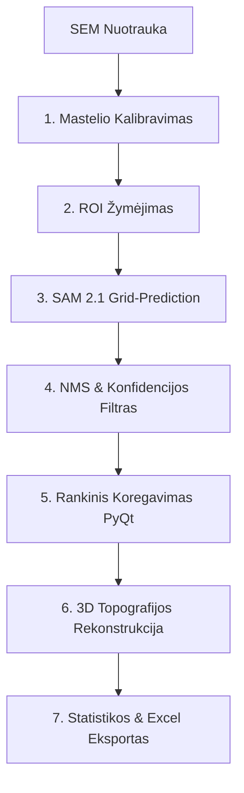

# 🧠 SAM 2.1 Grūdelių Atpažinimo ir 3D Analizės Variklis (`sam2_sem_analyzer.py`)

Naujajame integracijos faile **[sam2_sem_analyzer.py](sam2_sem_analyzer.py)** įdiegta automatizuota ir interaktyvi grūdelių atpažinimo sistema, veikianti ant **Meta Segment Anything 2.1 (SAM 2)** neuroninio tinklo pagrindo.

Žemiau pateikiamas detalus algoritminis darbo eigos ir funkcionavimo aprašymas:

### 1. Pradinis Kalibravimas ir Mastelis
*   **Mastelio Baras**: Vartotojas interaktyviai pažymi du taškus ant SEM nuotraukoje esančios mastelio juostos ir įveda jos tikrąjį ilgį mikrometrais ($\mu\text{m}$). Taip apskaičiuojamas tikslus pikselio dydžio santykis su realiu masteliu ($px \to \mu\text{m}$).
*   **ROI (Region of Interest)**: Naudojant `RectangleSelector`, iškerpama tik naudingoji nuotraukos sritis, atmetant techninius užrašus bei rėmelius nuotraukos apačioje.

### 2. Segmentavimas per Dense-Prompt Grid
*   **Modelio Užkrovimas**: Programa inicializuoja `SAM2AutomaticMaskGenerator` modelį iš `sam2.1_hiera_large.pt` svorių failo. Jei sistemoje yra Nvidia vaizdo plokštė su įdiegta CUDA, skaičiavimai automatiškai perkeliami į GPU.
*   **Tankus tinklelis (Point Grid)**: Nuotraukoje generuojamas tankus virtualių taškų tinklelis ($32 \times 32$ arba $64 \times 64$), kurie naudojami kaip taškiniai modelio sužadintuvai (prompts).
*   **Non-Maximum Suppression (NMS)**: Kad būtų išvengta persidengiančių ar dubliuotų kaukių aplink tą patį grūdelį, taikomas NMS algoritmas su $IoU \ge 0.7$ slenksčiu.
*   **Kokybės Filtravimas**: Atrenkamos tik tos kaukės, kurių patikimumo koeficientas (IoU score) yra $\ge 0.88$ ir stabilumo balas (stability score) yra $\ge 0.92$.

### 3. 3D Reljefo Rekonstrukcija (Shape-from-Shading metodas)
> **Segment Anything (SAM 2.1)** yra **2D segmentavimo neuroninis tinklas**, kuris nustato grūdelių ribas (kaukas), tačiau pats neatlieka gylio (giliojo) matavimo. 
> 
> Trimatė topografija (3D žemėlapis) yra sukuriama naudojant klasikinį **Shape-from-Shading** (intensyvumo vertimo į gylį) matematinį algoritmą:

*   **Pilkumo-Gylio Atitikmuo**: Kadangi SEM sekundarinių elektronų intensyvumas (pikselio šviesumas nuo 0 iki 255) yra tiesiogiai susijęs su kietojo elektrolito lūžio paviršiaus polinkio kampu, pilkumo skalės vertės yra tiesiogiai konvertuojamos į santykinį gylio ($z$) žemėlapį mikrometrais:
    $$z_ {\text{um}} = I(x, y) \times \frac{w}{255} \times 0.1 \times \text{scale}$$
    *(čia $I(x,y)$ yra pikselio intensyvumas, $w$ – vaizdo plotis, o `scale` – pikselio dydžio santykis su realybe).*
*   **3D Paviršiaus Plotas**: Kiekvieno grūdelio realus trimatis plotas skaičiuojamas skaitmeniškai integruojant erdvinį gradientą per visą grūdelio kaukės sritį:
    $$A_ {3D} = \iint_ {\text{Mask}} \sqrt{1 + \left(\partial z / \partial x\right)^2 + \left(\partial z / \partial y\right)^2} \,dx\,dy$$
    *(išvestinės $\partial z / \partial x$ ir $\partial z / \partial y$ apskaičiuojamos naudojant antros eilės centrinių skirtumų metodą `np.gradient`).*
*   **Šiurkštumas $R_ {a}$**: Skaičiuojamas kaip vidutinis absoliutus gylio verčių nuokrypis nuo grūdelio paviršiaus vidurkio:
    $$R_ {a} = \frac{1}{N}\sum_ {i=1}^{N} |z_ {i} - \bar{z}|$$
 
### 4. Skilimo Mechanizmo Klasifikacija
Programa automatiškai identifikuoja, ar kietasis elektrolitas lūžo per grūdelių ribas (**Intergranuliarinis skilimas**), ar tiesiai per pačius grūdelius (**Transgranuliarinis skilimas**):
*   Taikoma kaukės erozija, leidžianti išskirti grūdelio centrą (Interior) ir pakraštį (Boundary).
*   Apskaičiuojamas gylio skirtumas tarp šių dviejų zonų:
    $$\Delta Z = \bar{Z}_ {\text{interior}} - \bar{Z}_ {\text{boundary}}$$
*   Jei $\Delta Z > 0.5\,\mu\text{m}$, skilimas klasifikuojamas kaip *Stipriai Intergranuliarinis*, jei $\Delta Z < -0.5\,\mu\text{m}$ – *Transgranuliarinis*, o tarpinėse reikšmėse – *Mišrus*.

### 5. Interaktyvus PyQt Korektorius
Jeigu dirbtinis intelektas praleidžia smulkius grūdelius arba sujungia kelis į vieną, vartotojas gali naudotis grafiniu korektoriumi (`InteractiveSAMCorrector`):
*   **Kairysis pelės klavišas**: Prideda naują grūdelį (SAM automatiškai išplečia kaukę pagal paspaustą vietą).
*   **Dešinysis pelės klavišas**: Pašalina neteisingai aptiktą kaukę.
*   **Slankikliai**: Kontūro sušvelninimas (Smoothing) per Gauso filtrą ir kaukės neskaidrumo reguliavimas realiuoju laiku.
